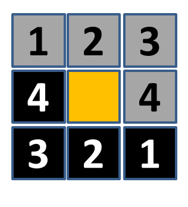

# DoubleSlidedApp
Java computer application game to slide tiles into the correct order

## How to launch
To launch the application, execute the Launch.java file

## How to play
### Objective
Flip the tiles in the least amount of steps to result in the final configuration 

### Rules
The eight tiles only depict the numbers 1, 2, 3, or 4. 
The tiles are double-sided. The number on each double-sided tile adds up to 5. 
Thus when a tile has "1" on one side, it has "4" on the other. Each tile has a 
gray-side with its digit drawn in black and the opposite side is colored in black 
with its digit drawn in white. When you slide a tile into the adjacent empty space 
(shown in yellow) the tile flips as part of that move. Click on a tile adjacent to
the empty space to flip it there.

### Losing Condition
If at any time a digit appears four different times simultaneously in the puzzle, the player immediately loses
